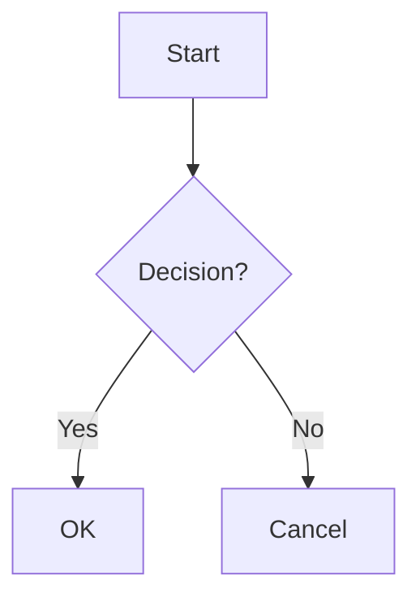

# MarkThatDown - Advanced Real-time Collaborative Markdown Editor

A modern, feature-rich collaborative markdown editor with real-time collaboration, advanced formatting, and beautiful UI.

## ✨ Features

### 🚀 Core Features
- **Real-time Collaboration** - Multiple users can edit simultaneously
- **Live Preview** - See your markdown rendered in real-time
- **Modern Dark/Light Theme** - Beautiful, responsive UI
- **Auto-save** - Your work is automatically saved
- **Export Functionality** - Download your documents in various formats

### 🔐 Authentication & User Management
- **User Registration & Login** - Secure user accounts
- **JWT Authentication** - Secure token-based authentication
- **User Profiles** - Personalized experience
- **Session Management** - Persistent login sessions

### 📝 Advanced Markdown Features
- **Enhanced Markdown Support** - Tables, task lists, strikethrough, emojis
- **Mathematical Expressions** - MathJax integration for LaTeX math
- **Diagrams & Charts** - Mermaid.js for flowcharts, sequence diagrams
- **Code Highlighting** - Syntax highlighting for code blocks
- **Rich Text Toolbar** - Quick formatting buttons

### 🔍 Search & Replace
- **Find Text** - Search within your document
- **Replace Text** - Replace individual occurrences
- **Replace All** - Replace all occurrences at once
- **Case Sensitive** - Toggle case sensitivity
- **Whole Word** - Match whole words only

### 📋 Document Templates
- **Meeting Notes** - Structured meeting documentation
- **Project Plan** - Comprehensive project planning
- **Blog Post** - Blog writing template
- **Technical Documentation** - API and system documentation
- **Research Paper** - Academic writing template
- **Blank Document** - Start from scratch

### 📚 Document Management
- **Version History** - Track document changes over time
- **Document Comments** - Add comments and annotations
- **Document Sharing** - Share documents with others
- **File Upload** - Upload images and files

### 🎨 UI/UX Features
- **Theme Toggle** - Switch between dark and light themes
- **Fullscreen Mode** - Distraction-free editing
- **Responsive Design** - Works on all devices
- **Keyboard Shortcuts** - Power user features
- **Notifications** - Real-time feedback

### 🔧 Developer Features
- **RESTful API** - Complete API for integration
- **WebSocket Support** - Real-time communication
- **File Upload API** - Handle file uploads
- **Health Check Endpoints** - Monitor application status

## 🚀 Quick Start

### Prerequisites
- Node.js (>= 14.0.0)
- npm (>= 6.0.0)

### Installation

1. **Clone the repository**
   ```bash
   git clone https://github.com/yourusername/MarkThatDown.git
   cd MarkThatDown
   ```

2. **Install dependencies**
   ```bash
   npm install
   ```

3. **Start the server**
   ```bash
   npm start
   ```

4. **Open your browser**
   ```
   http://localhost:8000
   ```

### Development Mode
```bash
npm run dev
```

## 📖 Usage Guide

### Getting Started
1. **Create a new document** - Visit `http://localhost:8000` for a new document
2. **Share with others** - Share the URL with collaborators
3. **Start editing** - Begin typing in the editor panel
4. **See live preview** - Watch your markdown render in real-time

### Authentication
1. **Register** - Click "Register" to create an account
2. **Login** - Use your credentials to log in
3. **Stay logged in** - Your session persists across browser sessions

### Using Templates
1. **Open templates** - Click the template button in the editor
2. **Select template** - Choose from available templates
3. **Customize** - Modify the template to fit your needs

### Search & Replace
1. **Open search** - Press `Ctrl+F` or click the search button
2. **Enter search term** - Type what you want to find
3. **Configure options** - Set case sensitivity and whole word matching
4. **Replace** - Use replace or replace all as needed

### Adding Comments
1. **Open comments panel** - Click the comments button
2. **Add comment** - Type your comment and press Enter
3. **View comments** - See all comments in the panel

### Exporting Documents
1. **Click export** - Use the export button in the header
2. **Choose format** - Select your preferred format
3. **Download** - Your document will be downloaded

## ⌨️ Keyboard Shortcuts

| Shortcut | Action |
|----------|--------|
| `Ctrl+S` | Save/Export document |
| `Ctrl+Enter` | Toggle preview |
| `Ctrl+F` | Open search |
| `Ctrl+T` | Toggle theme |
| `Tab` | Insert tab in editor |

## 🎨 Themes

### Dark Theme (Default)
- Modern dark interface
- Easy on the eyes
- Professional appearance

### Light Theme
- Clean, bright interface
- Traditional document appearance
- Better for daytime use

## 📝 Markdown Features

### Basic Formatting
```markdown
# Heading 1
## Heading 2
### Heading 3

**Bold text**
*Italic text*
~~Strikethrough~~

- Unordered list
- Another item

1. Ordered list
2. Second item

> Blockquote
```

### Advanced Features
```markdown
| Table | Header |
|-------|--------|
| Cell 1 | Cell 2 |

- [ ] Task list item
- [x] Completed task

`inline code`

```javascript
// Code block
function hello() {
    console.log("Hello World!");
}
```


[Link](url)
```

### Mathematical Expressions
```markdown
Inline math: $E = mc^2$

Block math:
$$
\int_{-\infty}^{\infty} e^{-x^2} dx = \sqrt{\pi}
$$
```

### Diagrams
```markdown

```

## 🔧 API Reference

### Authentication Endpoints
- `POST /api/register` - Register new user
- `POST /api/login` - User login

### Document Endpoints
- `GET /api/document/:id` - Get document info
- `GET /api/document/:id/history` - Get document history
- `POST /api/document/:id/export/pdf` - Export to PDF

### File Upload
- `POST /api/upload` - Upload files

### Health Check
- `GET /health` - Application status

## 🛠️ Configuration

### Environment Variables
```bash
PORT=8000                    # Server port
JWT_SECRET=your-secret-key   # JWT signing secret
NODE_ENV=production          # Environment mode
```

### Customization
- Modify `public/style.css` for theme customization
- Edit `views/pad.ejs` for layout changes
- Update `server.js` for server-side features

## 🤝 Contributing

1. Fork the repository
2. Create a feature branch
3. Make your changes
4. Add tests if applicable
5. Submit a pull request

## 📄 License

This project is licensed under the MIT License - see the [LICENSE](LICENSE) file for details.

## 🙏 Acknowledgments

- [Showdown.js](https://github.com/showdownjs/showdown) - Markdown to HTML converter
- [Socket.IO](https://socket.io/) - Real-time communication
- [Font Awesome](https://fontawesome.com/) - Icons
- [MathJax](https://www.mathjax.org/) - Mathematical expressions
- [Mermaid.js](https://mermaid-js.github.io/) - Diagrams and charts

## 📞 Support

- **Issues**: [GitHub Issues](https://github.com/yourusername/MarkThatDown/issues)
- **Discussions**: [GitHub Discussions](https://github.com/yourusername/MarkThatDown/discussions)
- **Email**: support@markthatdown.com

---

**Made with ❤️ by the MarkThatDown Team** 